# 道养生活 TaoLife

中医养生健康管理平台 —— 基于 Spring Boot 4 + Vue 3 + uni-app 构建，涵盖养生知识库、AI 智能问答、个性化调理方案、会员体系等核心功能。

## 项目架构

```
TaoLife/
├── taolife-server/           # 后端服务（Spring Boot 4 + Java 25）
├── taolife-admin/            # 管理后台（Vue 3 + Vite + Naive UI）
├── taolife-weapp/            # 微信小程序（uni-app + Vue 3 + TDesign）
├── db/                       # 数据库 SQL 文件
└── docs/                     # 项目文档
```

## 应用截图

<table>
  <tr>
    <td align="center"><b>首页</b></td>
    <td align="center"><b>AI 问答</b></td>
    <td align="center"><b>调理方案</b></td>
  </tr>
  <tr>
    <td>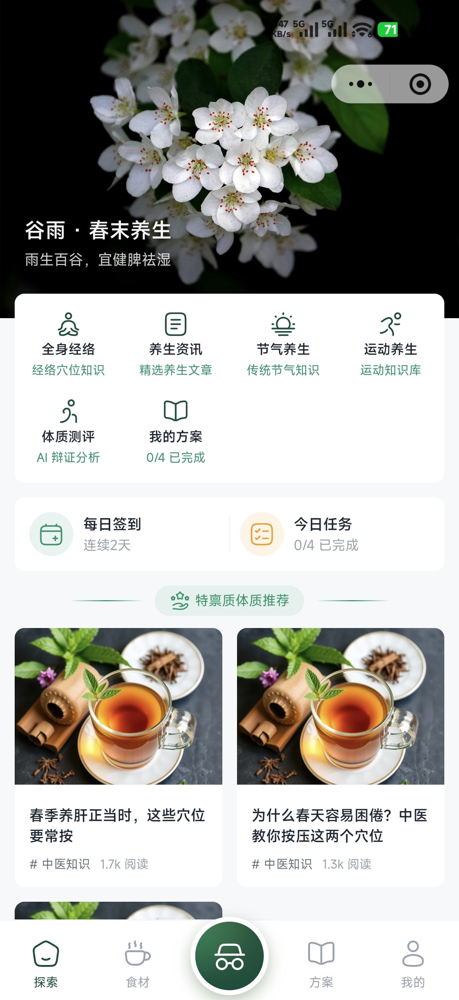</td>
    <td>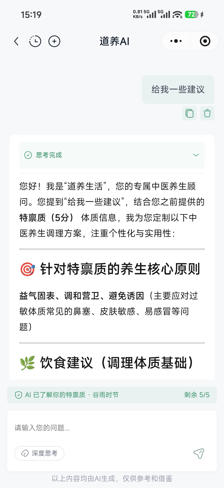</td>
    <td>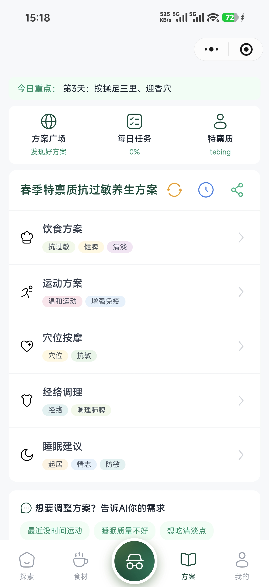</td>
  </tr>
  <tr>
    <td align="center"><b>药食库</b></td>
    <td align="center"><b>个人中心</b></td>
    <td align="center"><b>体质测评</b></td>
  </tr>
  <tr>
    <td>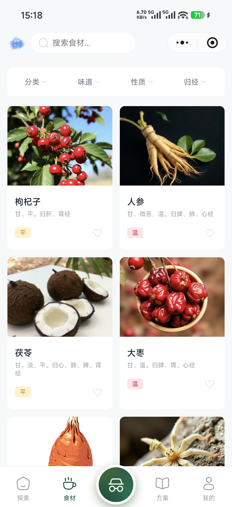</td>
    <td>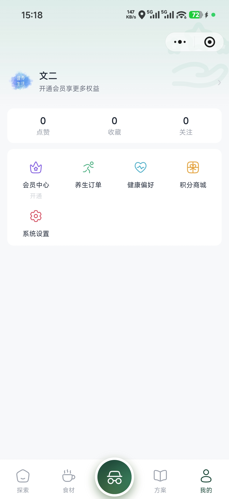</td>
    <td>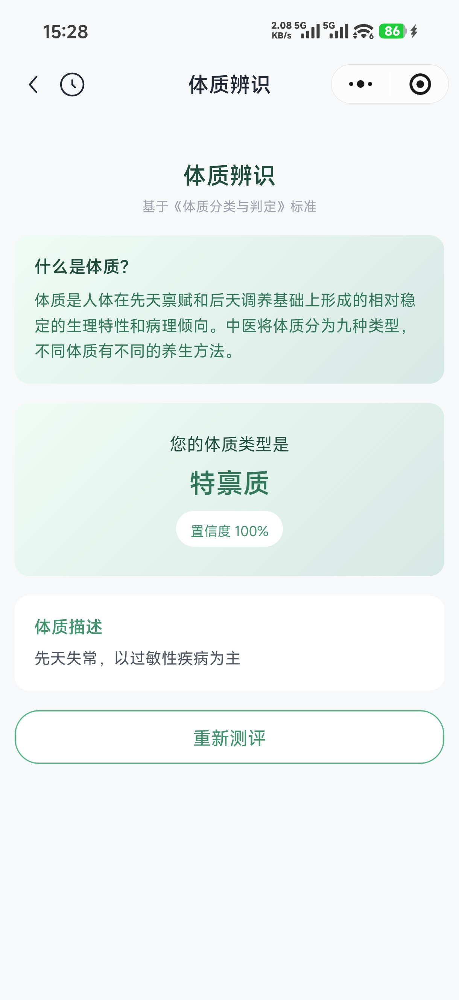</td>
  </tr>
</table>

<details>
<summary>更多截图</summary>

<table>
  <tr>
    <td align="center"><b>AI 问答</b></td>
    <td align="center"><b>对话历史</b></td>
    <td align="center"><b>方案详情</b></td>
  </tr>
  <tr>
    <td>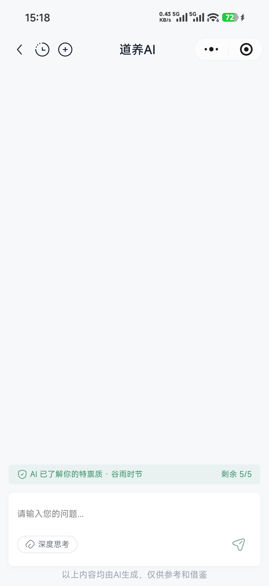</td>
    <td>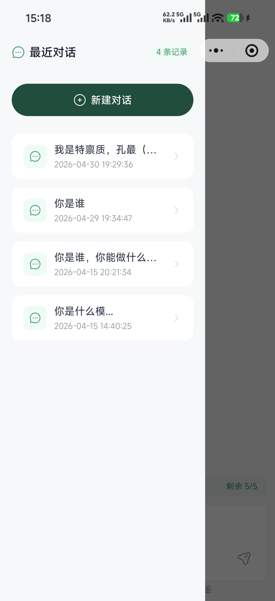</td>
    <td>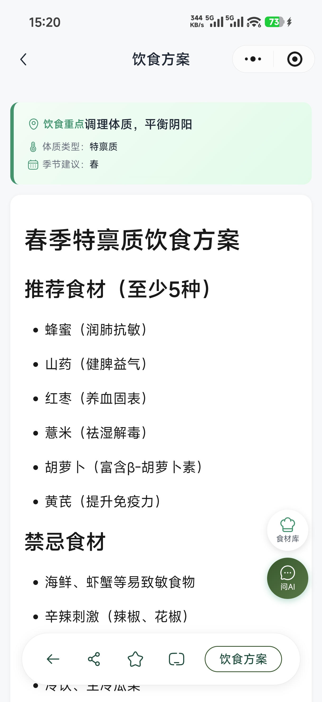</td>
  </tr>
  <tr>
    <td align="center"><b>方案历史</b></td>
    <td align="center"><b>方案广场</b></td>
    <td align="center"><b>会员中心</b></td>
  </tr>
  <tr>
    <td>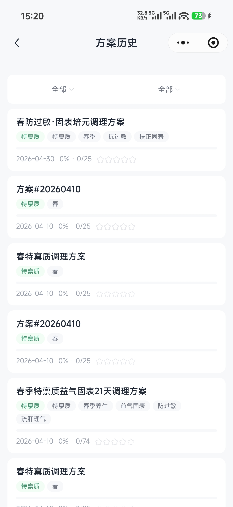</td>
    <td>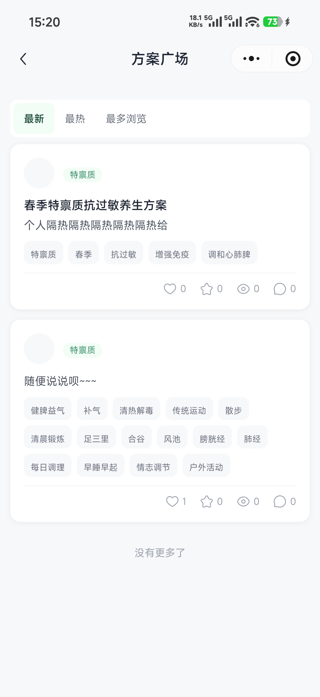</td>
    <td>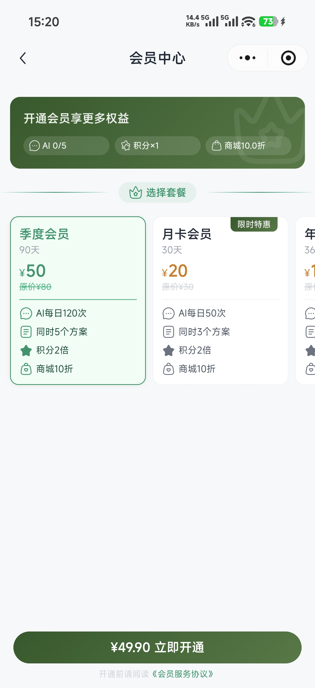</td>
  </tr>
</table>

</details>

## 核心功能

| 模块 | 功能 |
|------|------|
| 身份认证 | 微信登录、账号管理、RBAC 权限控制、用户偏好 |
| 养生知识库 | 药食同源食材库、运动养生、经络穴位、二十四节气、养生文章、中医体质辨识 |
| AI 智能问答 | 多模型支持（OpenAI / DeepSeek / 智谱）、RAG 文档检索（Milvus）、Prompt 模板、敏感词过滤 |
| 个性化调理方案 | 五维度方案（饮食 / 运动 / 穴位 / 经络 / 生活起居）、每日任务、方案广场、周期报告 |
| 会员体系 | 会员套餐、微信支付、积分商城、每日签到、成长等级、广告变现 |

## 技术栈

### 后端 (taolife-server)

| 技术 | 版本 | 说明 |
|------|------|------|
| Java | 25 | 编程语言 |
| Spring Boot | 4.0.6 | 应用框架 |
| Spring Security | 7.x | 安全认证 |
| MyBatis-Flex | 1.11.6 | ORM 框架 |
| MySQL | 9.6.0 | 关系型数据库 |
| Redis | — | 缓存 / 会话 / 限流 |
| Milvus | 2.6.17 | 向量数据库（AI 文档检索） |
| 腾讯云 COS | 5.6.265 | 对象存储 |
| JWT (jjwt) | 0.13.0 | Token 认证 |
| MapStruct | 1.6.3 | 对象映射 |
| Log4j2 | 2.25.4 | 异步日志（Disruptor） |
| OpenTelemetry | 1.48.0 | 可观测性 |

### 管理后台 (taolife-admin)

| 技术 | 版本 | 说明 |
|------|------|------|
| Vue | 3.5.x | 前端框架 |
| Vite | 8.0.x | 构建工具 |
| TypeScript | 6.0.x | 类型系统 |
| Naive UI | 2.44.x | UI 组件库 |
| Pinia | 3.0.x | 状态管理 |
| Alova | 3.5.x | HTTP 请求 |
| UnoCSS | 66.x | 原子 CSS |
| ECharts | 6.x | 图表 |

### 微信小程序 (taolife-weapp)

| 技术 | 版本 | 说明 |
|------|------|------|
| uni-app | 3.0.x | 跨端框架 |
| Vue | 3.4.x | 前端框架 |
| TDesign | 0.8.x | UI 组件库 |
| UnoCSS | 66.x | 原子 CSS |
| TypeScript | 5.9.x | 类型系统 |

## 项目结构

```
taolife-server/
├── taolife-app/            # 启动模块（配置、主入口）
├── taolife-common/         # 公共模块（安全、工具、异常处理、监控）
└── taolife-biz/
    ├── taolife-identity/   # 认证授权
    ├── taolife-wisdom/     # 养生知识库
    ├── taolife-aicore/     # AI 核心能力（LLM 适配层）
    ├── taolife-aichat/     # AI 智能问答
    ├── taolife-plan/       # 个性化调理方案
    └── taolife-fee/        # 会员 / 支付 / 积分
```

## 快速开始

### 环境要求

- JDK 25+
- Maven 3.9+
- MySQL 8.0+
- Redis 6.0+
- Milvus 2.x（AI 文档检索，可选）
- Node.js 20+
- pnpm 9+
- 微信开发者工具（小程序调试）

### 数据库初始化

```sql
-- 1. 创建数据库
CREATE DATABASE taolife_dev DEFAULT CHARACTER SET utf8mb4 COLLATE utf8mb4_unicode_ci;
```

```bash
# 2. 导入表结构 + 初始化数据
mysql -u root -p taolife_dev < db/taolife_dev_init.sql
```

<details>
<summary>已包含的初始化数据（28 张表，965 条记录）</summary>

**系统管理（必须）**

| 表名 | 说明 | 记录数 |
|------|------|--------|
| `tl_sys_user` | 管理员账号 | 2 |
| `tl_sys_role` | 角色 | 2 |
| `tl_sys_permission` | 权限（菜单 / 按钮 / 接口） | 49 |
| `tl_sys_role_permission` | 角色-权限关联 | 50 |
| `tl_sys_agreement` | 系统协议（关于 / 协议 / 隐私） | 3 |

**养生知识库（必须）**

| 表名 | 说明 | 记录数 |
|------|------|--------|
| `tl_wis_fitness_type` | 9 种中医体质类型 | 9 |
| `tl_wis_fitness_question` | 体质问卷题目 | 91 |
| `tl_wis_fitness_option` | 体质问卷选项 | 436 |
| `tl_wis_solar_term` | 二十四节气 | 24 |
| `tl_wis_solar_term_card` | 节气卡片 | 5 |
| `tl_wis_meridian` | 经络数据 | 14 |
| `tl_wis_acupoint` | 穴位数据 | 163 |
| `tl_wis_acupoint_combo` | 穴位配伍 | 11 |
| `tl_wis_exercise` | 运动项目 | 12 |
| `tl_wis_article` | 养生文章 | 10 |
| `tl_wis_food` | 食材数据 | 6 |

**AI 配置（推荐）**

| 表名 | 说明 | 记录数 |
|------|------|--------|
| `tl_ai_provider` | AI 厂商 | 3 |
| `tl_ai_model` | AI 模型 | 5 |
| `tl_ai_provider_endpoint` | AI 端点 | 5 |
| `tl_ai_scene_config` | AI 场景配置 | 2 |
| `tl_ai_prompt_template` | Prompt 模板 | 9 |
| `tl_ai_sensitive_word` | 敏感词 | 5 |

**会员 / 积分（推荐）**

| 表名 | 说明 | 记录数 |
|------|------|--------|
| `tl_fee_points_rule` | 积分规则 | 7 |
| `tl_fee_growth_level` | 成长等级 | 9 |
| `tl_fee_member_plan` | 会员套餐 | 4 |
| `tl_fee_ad_config` | 广告配置 | 5 |
| `tl_fee_points_goods` | 积分商品 | 4 |
| `tl_fee_home_banner` | 首页轮播 | 20 |

</details>

### 后端启动

```bash
cd taolife-server
mvn clean install -DskipTests
cd taolife-app
mvn spring-boot:run
# 服务启动在 http://localhost:35515
```

### 管理后台启动

```bash
cd taolife-admin
pnpm install
pnpm dev
# 访问 http://localhost:9980
```

### 微信小程序启动

```bash
cd taolife-weapp
pnpm install
pnpm dev:mp-weixin
# 在微信开发者工具中导入 dist/dev/mp-weixin 目录
```

## 配置说明

| 配置项 | 文件路径 |
|--------|---------|
| 后端主配置 | `taolife-server/taolife-app/src/main/resources/application.yml` |
| 后端开发环境 | `taolife-server/taolife-app/src/main/resources/application-dev.yml` |
| 后端生产环境 | `taolife-server/taolife-app/src/main/resources/application-prd.yml` |
| 管理后台公共 | `taolife-admin/.env` |
| 管理后台开发 | `taolife-admin/.env.dev` |
| 管理后台生产 | `taolife-admin/.env.production` |
| 小程序公共 | `taolife-weapp/.env` |
| 小程序开发 | `taolife-weapp/.env.development` |
| 小程序生产 | `taolife-weapp/.env.production` |

部署前需修改以下配置：数据库连接、Redis 连接、JWT 密钥、微信小程序 AppID/AppSecret、腾讯云 COS 配置。

## 部署

### 后端

```bash
# 打包
cd taolife-server
mvn clean package -DskipTests

# 运行（默认 dev 环境）
java -jar taolife-app/target/taolife-app-1.0.0.jar

# 生产环境
java -jar taolife-app/target/taolife-app-1.0.0.jar --spring.profiles.active=prd
```

### 管理后台

```bash
cd taolife-admin
pnpm install
pnpm build
# 构建产物在 dist/ 目录，部署到 Nginx 或其他静态服务器
```

Nginx 参考配置：

```nginx
server {
    listen 443 ssl;
    server_name taolife.com;

    ssl_certificate     /path/to/cert.pem;
    ssl_certificate_key /path/to/key.pem;

    root /var/www/taolife-admin/dist;
    index index.html;

    location / {
        try_files $uri $uri/ /index.html;
    }
}
```

### 微信小程序

```bash
cd taolife-weapp
pnpm install
pnpm build:mp-weixin:prod
# 构建产物在 dist/build/mp-weixin 目录
# 在微信开发者工具中导入该目录，点击「上传」提交审核
```

### 部署后配置清单

后端启动后，登录管理后台完成以下配置：

| 步骤 | 配置项 | 说明 |
|------|--------|------|
| 1 | 修改管理员密码 | 初始账号的密码为开发环境密码，上线前务必修改 |
| 2 | 系统协议内容 | 编辑「关于我们」「用户协议」「隐私政策」的实际内容 |
| 3 | AI 厂商 API Key | 在 AI 管理 → 模型供应商中配置实际的 API Key |
| 4 | 微信支付 | 编辑 `application-prd.yml` 中 `wx-pay` 配置，启用支付 |
| 5 | 腾讯云 COS | 将 Bucket 切换为生产环境 Bucket |
| 6 | 首页轮播图 | 替换为正式的运营图片 |
| 7 | 会员套餐价格 | 根据实际定价调整套餐价格 |
| 8 | 小程序 AppID | `application.yml` 中 `wx-miniprogram.app-id` 改为正式小程序的 AppID |
| 9 | CORS 域名 | `application-prd.yml` 中 `allowed-origins` 改为实际域名 |
| 10 | AES 加密密钥 | `application.yml` 中 `encryption.aes-key` 替换为新的随机密钥，更换后需重新配置 AI API Key |

## AI 功能配置

AI 模块采用五层配置结构，通过管理后台（AI 管理）进行配置：

```
厂商 (Provider) → 端点 (Endpoint) → 模型 (Model)
                                          ↓
场景 (SceneConfig) ← 关联模型 (SceneModel)
      ↓
提示词模板 (PromptTemplate)
```

### 配置流程

1. **添加厂商** — 在「模型供应商」中添加 AI 厂商，填写 API Endpoint 和 API Key（加密存储）
2. **配置端点** — 在「供应商端点」中配置各 API 路径（如 `/chat/completions`、`/embeddings`）
3. **添加模型** — 在「模型实例」中配置具体模型（如 `glm-4-flash`、`deepseek-chat`），设置 temperature、max_tokens 等参数
4. **创建场景** — 在「场景配置」中关联模型和 Prompt 模板，设定知识检索阈值、历史消息数等
5. **编辑模板** — 在「Prompt 模板」中管理各场景的系统提示词，支持 `${变量}` 占位符

### 内置场景

| 场景编码 | 说明 |
|----------|------|
| `ai_chat` | AI 聊天（用户端智能问答） |
| `constitution_assessment` | 体质评估（中医体质辨识） |

### 内置 Prompt 模板

| 模板编码 | 类型 | 说明 |
|----------|------|------|
| `global_context` | global_context | 全局上下文（自动追加到每条消息） |
| `chat_system` | system_prompt | AI 聊天系统提示词 |
| `constitution_system` | system_prompt | 体质评估系统提示词 |
| `plan_generation` | common_prompt | 养生方案生成 |
| `plan_adjustment` | user_prompt | 方案单条调整 |
| `plan_batch_adjustment` | user_prompt | 方案批量调整 |
| `plan_adjustment_suggestion` | system_prompt | 方案调整建议标签 |
| `cycle_report` | common_prompt | 周期报告生成 |
| `forbidden_categories` | system_prompt | 禁止分类规则 |

### 负载均衡

通过「场景-模型关联」（`tl_ai_scene_model`）支持多模型负载均衡：

- **priority** — 优先级，数字越大越优先
- **weight** — 同优先级下按权重分配流量
- **max_concurrency** — 场景级最大并发数
- **concurrency_strategy** — 满载策略：`REJECT`（拒绝）/ `QUEUE`（排队）/ `FALLBACK`（降级）

### 知识库 (RAG)

AI 问答支持基于 Milvus 向量数据库的 RAG 检索增强，通过管理后台的「文档管理」上传养生知识文档，系统自动向量化并用于 AI 回答时的上下文引用。

## API 加密

系统内置接口加解密机制，默认**关闭**。开启后对请求/响应进行 HMAC 签名验证，可选择性启用 AES 加密。

### 工作模式

| 模式 | 说明 |
|------|------|
| 关闭（默认） | 不签名、不加密 |
| 仅验签 | 验证请求签名，不加密请求/响应体（`sign-only: true`） |
| 验签 + 加密 | 签名 + AES-GCM 加密请求和响应体 |

### 开启方式

前后端需同步配置相同的密钥：

**后端** — `application.yml`：
```yaml
taolife:
  security:
    encrypt:
      enabled: true           # 开启加密
      sign-only: false         # true=仅验签，false=验签+加密
      hmac-secret: "your-base64-hmac-secret"
```

**管理后台** — `taolife-admin/.env`：
```
VITE_API_ENCRYPT = true
VITE_ENCRYPT_HMAC_SECRET = your-base64-hmac-secret
```

**小程序** — `taolife-weapp/.env`：
```
VITE_API_ENCRYPT = true
VITE_ENCRYPT_HMAC_SECRET = your-base64-hmac-secret
```

### 注意事项

- HMAC Secret 在三端必须一致（Base64 编码）
- 小程序环境因加密 API 限制，使用 AES-CTR 模式替代 GCM 模式，使用 PKCS1v15 替代 OAEP
- 加密过滤器仅处理带有 `@Encrypted` 注解的接口，未标注的接口不受影响
- API Key 等敏感字段的数据库加密（AES-256-GCM）是独立机制，默认启用，不受此开关控制

## 数据库

- 表前缀：`tl_`
- 主键：`Binary(16)`（UUID）
- 布尔字段：`0` / `1`
- 模块分组：`tl_ai_*`（AI）、`tl_fee_*`（会员支付）、`tl_id_*`（身份认证）、`tl_plan_*`（调理方案）、`tl_sys_*`（系统管理）、`tl_wis_*`（养生知识库）
- 完整表结构见 `db/taolife_dev_structure.sql`

## 许可证

[MIT](LICENSE)
